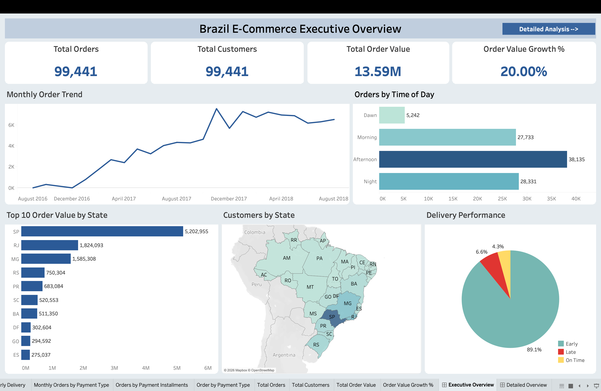
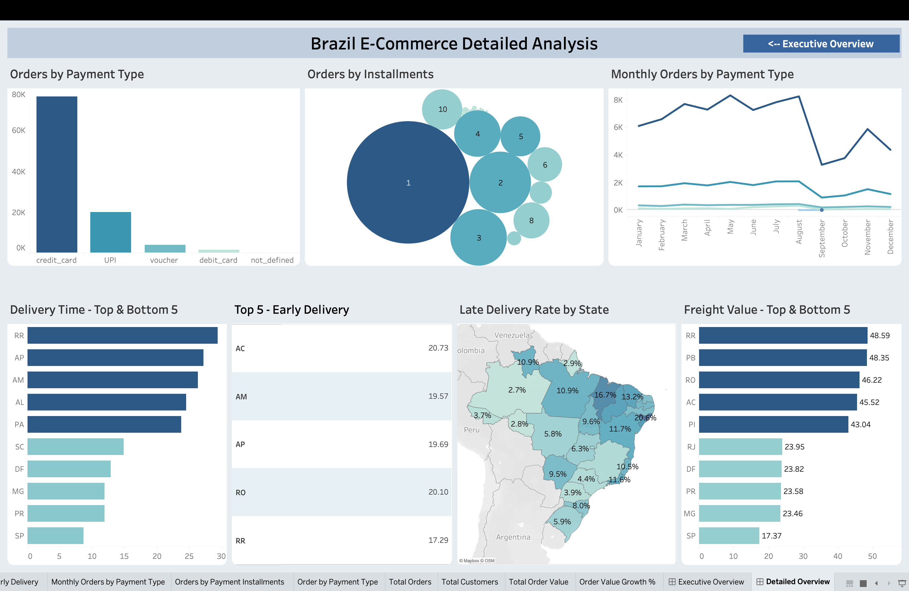

# 🛒 Target Brazil E-Commerce Analysis | SQL & Tableau

## 📌 Project Overview

This project analyzes Target Brazil's e-commerce data using SQL in Google BigQuery and Tableau to uncover insights into customer purchasing behavior, sales trends, regional performance, delivery efficiency, freight costs, and payment patterns.

The analysis combines SQL-based data exploration and business analysis with interactive Tableau dashboards to transform raw e-commerce data into actionable business insights.

## 🎯 Business Context

Target is a leading retail company with a strong e-commerce presence in Brazil. This project analyzes approximately **100,000 e-commerce orders** placed between **2016 and 2018** to understand customer purchasing behavior, sales trends, logistics performance, delivery efficiency, and payment patterns.

Using SQL and Tableau, this project generates data-driven insights and business recommendations to support marketing, logistics, and operational decision-making.

## 📂 Dataset Information

This project uses the **Target Brazil E-commerce Dataset**, containing approximately **100,000 orders** placed between **2016 and 2018**.

The dataset consists of eight relational tables:

| Table | Description |
|--------|-------------|
| customers | Customer information |
| orders | Order details |
| order_items | Product pricing and freight |
| payments | Payment information |
| products | Product details |
| sellers | Seller information |
| reviews | Customer reviews |
| geolocation | Geographic information |

**Dataset Source:** [Google Drive Dataset](https://drive.google.com/drive/folders/1TGEc66YKbD443nslRi1bWgVd238gJCnb)

## 🔄 Project Workflow

The project followed a structured data analysis workflow:

1. Explored the dataset and understood table relationships.
2. Performed exploratory data analysis using SQL.
3. Analyzed customer purchasing behavior and order trends.
4. Evaluated regional sales and customer distribution.
5. Assessed logistics performance using freight and delivery metrics.
6. Examined payment methods and installment patterns.
7. Derived key business insights and recommendations.
8. Created interactive Tableau dashboards to visualize the findings.

## 🛠️ Tools & SQL Concepts

**Tools**
- Google BigQuery

**SQL Concepts**
- Joins
- Common Table Expressions (CTEs)
- Aggregate Functions
- Window Functions (`LAG`, `DENSE_RANK`)
- CASE Statements
- Date & Time Functions
- GROUP BY
- ORDER BY
- COUNT DISTINCT
- Mathematical Functions (`ROUND`)

## 📊 Business Questions

The analysis answers 17 business questions across four key areas:

### 1. Data Exploration
- Data types and table structure
- Order date range
- Geographical coverage

### 2. Customer & Regional Analysis
- Order growth and monthly seasonality
- Customer purchasing patterns by time of day
- Monthly order trends across states
- Customer distribution across states
- Order value by state

### 3. Sales, Freight & Delivery Analysis
- Year-over-year order value growth
- Total and average freight value by state
- Highest and lowest average freight costs
- Highest and lowest average delivery times
- States with the fastest delivery relative to estimates

### 4. Payment Analysis
- Monthly payment-type trends
- Distribution of orders by payment installments
  
## 📊 Tableau Dashboard

The SQL analysis was further visualized using Tableau to create interactive dashboards covering sales trends, customer distribution, delivery performance, freight costs, and payment behavior.

### Dashboards

- **Brazil E-Commerce Executive Overview**
  - Order and customer KPIs
  - Monthly order trends
  - Customer distribution by state
  - Order value by state
  - Delivery performance
  - Orders by time of day

- **Brazil E-Commerce Detailed Analysis**
  - Payment type and installment analysis
  - Monthly payment trends
  - Freight value by state
  - Delivery time by state
  - Early delivery performance
  - Late delivery rate by state

🔗 **[View Interactive Tableau Dashboard](https://public.tableau.com/shared/XKY2WFJYQ?:display_count=n&:origin=viz_share_link)**

### Dashboard Preview

#### Executive Overview

#### Detailed Analysis

## 💡 Key Insights

- 📈 Order volume showed an overall upward trend across the analysis period, indicating growing e-commerce activity.

- 🌆 São Paulo (SP) had the highest customer and order concentration, making it the strongest regional market.

- 🕑 The afternoon recorded the highest order activity, indicating peak customer engagement during this period.

- 💰 Order values and freight costs varied considerably across states, highlighting differences in regional market value and logistics costs.

- 🚚 Delivery performance varied across states, with several states receiving orders earlier than their estimated delivery dates.

- 💳 Credit cards were the most commonly used payment method, while installment-based payments were also widely used.

- 📊 The Tableau dashboards provide an interactive view of sales, customer, delivery, freight, and payment patterns identified through the SQL analysis.
  
## 🚀 Business Recommendations

- Prioritize marketing and customer acquisition efforts in high-performing states while identifying opportunities in lower-performing regions.

- Strengthen logistics operations in states with longer delivery times to improve overall delivery efficiency.

- Optimize regional freight costs through improved warehouse planning and delivery-route optimization.

- Prepare inventory and logistics capacity ahead of periods with higher seasonal demand.

- Use targeted promotions to encourage adoption of alternative payment methods and suitable installment options.

## 📁 Project Files

- [`queries.sql`](queries.sql) — SQL queries used to answer the 17 business questions.
- [`dashboard-1-executive-overview.png`](dashboard-1-executive-overview.png) — Tableau Executive Overview dashboard.
- [`dashboard-2-detailed-analysis.png`](dashboard-2-detailed-analysis.png) — Tableau Detailed Analysis dashboard.

